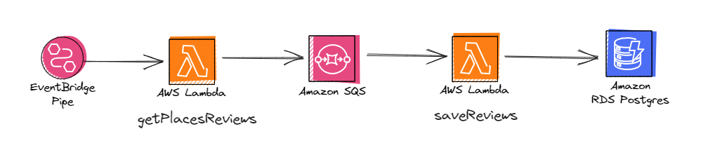

# Arcca

## Visão geral do projeto

Este é um projeto que usa Serverless Framework, AWS Lambda, AWS SQS e PostgreSQL.

É uma stack de desenvolvimento moderna para se facilitar a criação de tasks recorrentes.

## Preview

O objetivo é gerar um registro das reviews de 3 locais específicos de tempo em tempo, de forma a facilitar seu acesso futuro.

### Fluxos pensados

Dois fluxos pensados até agora utilizando serverless framework e lambda:

1. Função que pega todas locations, reviews e data da última review de cada location -> fila do SQS (a mensagem seria um json do tipo `{locationId: <id>, review: <string>, reviewDate: <datetime>}`) -> função que roda pegando batches de N locations e faz as capturas e inserts.

   1.1 Vantagens

   - Facilita a escalabilidade conforme mais lojas vão sendo aderidas à empresa.
   - Poucas mudanças necessárias até que se chegue em um número realmente gigante de reviews (perto de 1.000.000 reviews por consulta)

   1.2 Desvantagens

   - Mais complexo de se implementar, pois exige a separação em dois métodos e o uso de fila.
   - Aumento no consumo de dinheiro à AWS por gastar mais recursos.

2. Faz um script que roda tudo em uma função

   2.1 Vantagens

   - Implementação inicial mais simples.
   - Uso de menos recursos da AWS, e economia de dinheiro.

   2.2 Desvantagens

   - Baixa escalabilidade, precisa de mais suporte dos devs à longo prazo.

#### Fluxo escolhido

Penso que faz mais sentido o fluxo 1, mesmo que aumente a complexidade. A ideia do negócio da Arcca é aumentar com o tempo e com isso se torna necessário fazer um sistema que seja escalável, ainda que hoje em dia leve um tempo razoalvemente menor fazendo pelo método 2 (testar e pegar essa diferença de tempo).



## Alternativas de projetos de captura de dados do Google Reviews

1.
2.
3.

## Começando

Para iniciar o projeto, siga os passos abaixo:

- Clone o repositório em sua máquina local.
- Pelo terminal, entre na pasta em que o projeto foi clonado.
- Faça o setup da sua conta Google:
  - Crie uma conta.
  - Siga este [tutorial](https://developers.google.com/maps/documentation/elevation/cloud-setup?hl=pt-br) para criar um projeto, ativar as APIs de Place e Geocoding, e gerar sua chave do Google API.
- Faça o setup da sua conta AWS:
  - Crie uma conta na AWS, entre no IAM da AWS, crie um usuário e salve suas chaves geradas em csv durante o processo.
  - Crie uma pasta oculta `.aws` no seu root e nela salve as chaves geradas em um arquivo `credentials` (obs: sem extensão) da seguinte forma:
    ```
    [default]
    aws_access_key_id = chave1
    aws_secret_access_key = chave2
    ```
  - Entre no serviço SQS da AWS e crie uma fila.
  - Crie um arquivo `.env` no seu projeto e copie as variáveis do arquivo `sample.env` e preencha com as suas.

## Estrutura de pasta

```
├── .serverless              # Pasta gerada pelo deploy do Serverless
├── src                      # Código fonte
│   ├── helpers              # Pasta com funções de suporte
│   ├── assets               # Pasta com arquivos estáticos
│   └── index.js             # Entry point com funções para AWS
├── serverless.yml           # Configurações do projeto para uso da AWS
├── package.json             # Pacotes associados ao projeto
├── sample.env               # Exemplo de arquivo .env
└── README.md                # Documentação do projeto
```

## Tecnologias e funcionalidades

### Tecnologias

O projeto inclui as seguintes tecnologias:

- Serverless para abstrair a criação de funções lambdas, filas SQS e banco RDS da AWS
- AWS para uso de Lambda, SQS e PostgreSQL, na execução de métodos simples
- Google Place API e Geocode API para obtenção de dados dos clientes da Arcca
- Node.js para desenvolvimento e criação de métodos

### Funcionalidades

O projeto possui as seguintes funcionalidades:

- Criar funções Lambda a partir de código local
- Captar dados de reviews de clientes para armazenamento em banco Postgres e estruturação de dados

## Scripts

O projeto inclui os seguintes scripts:

`sls deploy`: Gera automaticamente a pilha com suas funções da AWS no seu painel, além de gerar um trigger para sua fila começar a funcionar.
`sls invoke --function nomeDaFunção`: Executa uma função específica.
`sls remove`: Remove a pilha e o trigger da fila

## Decisões técnicas

- Uso da api Geocode API usando o endereço das lojas para obtenção do `locationId` do comércio, pois é um valor variável:
  - [https://maps.googleapis.com/maps/api/geocode/json?address=${address}&sensor=false&key=${API_KEY}](https://developers.google.com/maps/documentation/geocoding?hl=pt-br):
  ```
  Retorno do endpoint
  {
    "results" : [
      {
        ...,
        "place_id": "ChIJtYuu0V25j4ARwu5e4wwRYgE",
        ...
      },
      ...
    ]
  }
  ```
- Uso da api Places API para obtenção das `reviews` de cada `location`:
  - [https://maps.googleapis.com/maps/api/place/details/json?place_id=${placeId}&reviews_sort=newest&key=${API_KEY}](https://developers.google.com/maps/documentation/places/web-service/details?hl=pt-br)
  ```
  Retorno do endpoint
  {
    "html_attributions" : [],
    "result" : {
      ...
      "reviews" :
        [
          {
              "author_name" : "A . Daniel",
              "author_url" : "https://www.google.com/maps/contrib/115135628913900329576/reviews",
              "language" : "pt",
              "original_language" : "pt",
              "profile_photo_url" : "https://lh3.googleusercontent.com/a-/ALV-UjVlBRFWne2_0BqRDPjHJ6fXytKzEcGkSPNoVFceXt5O-c4=s128-c0x00000000-cc-rp-mo",
              "rating" : 5,
              "relative_time_description" : "uma semana atrás",
              "text" : "Time 595 muito educados e simpáticos melhor loja equipe sol",
              "time" : 1695422512,
              "translated" : false
          },
            ...
        ],
        ...
    }
  }
  ```
- Por causa do retorno da Places API só trazer 5 `reviews`, se usa um eventBridge da AWS para que se busque as `reviews` de X em X minutos e seja enviado o retorno à uma fila SQS da AWS para enviar essas informações à função lambda `saveReviews` quer irá usar RDS da AWS para salvar em um banco Postgres.
- Para os comentários mais antigos, se utiliza --- TODO ---.

## Referências

### Serverless

- [Implementar Lambda na AWS usando Serverless Node](https://www.youtube.com/watch?v=oFYFqOzJdqY).
- [Doc do serverless](https://www.serverless.com/framework/docs/tutorial).

### AWS

- [Doc de fila SQS da AWS](https://aws.amazon.com/pt/sqs/).
- TODO - Ver como linkar o postgres (https://aws.amazon.com/pt/rds/).

## TODOs

- Criar layer no Lambda com Node para o import do SQS.
- Ver doc pra ver como chegam as mensagens no segundo metodo.
- Começar a testar o banco (RDS) e biblioteca de ORM pra falar com o banco.
- Adicionar a biblioteca de ORM do banco na layer.
- Fazer um hash usando Nome do autor, data do comentário e o texto (ou parte dele) para gerar um ID no banco e verificar se o registro já existe.
